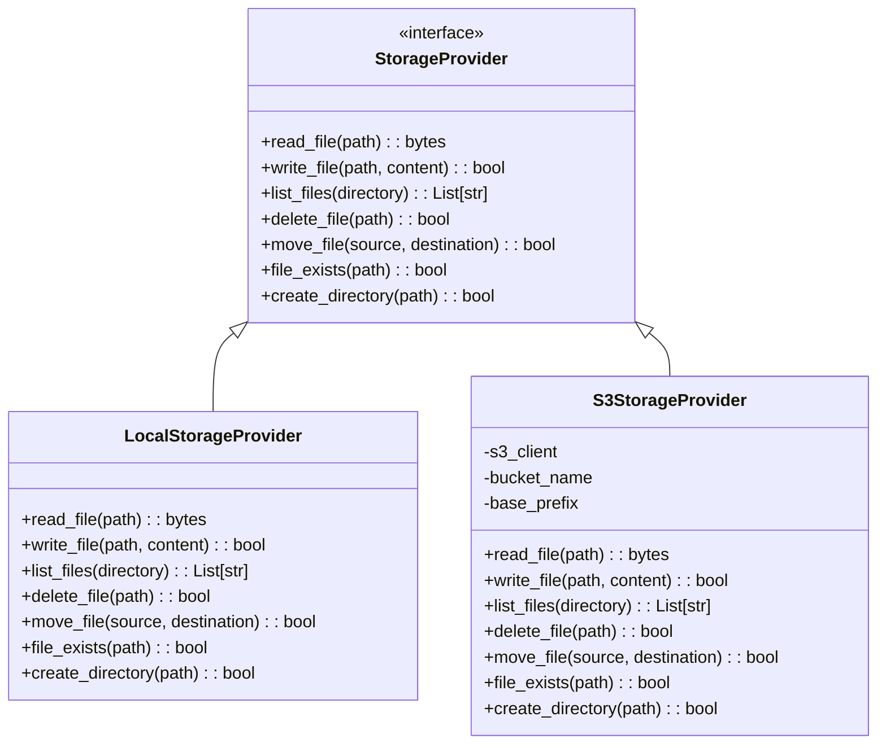
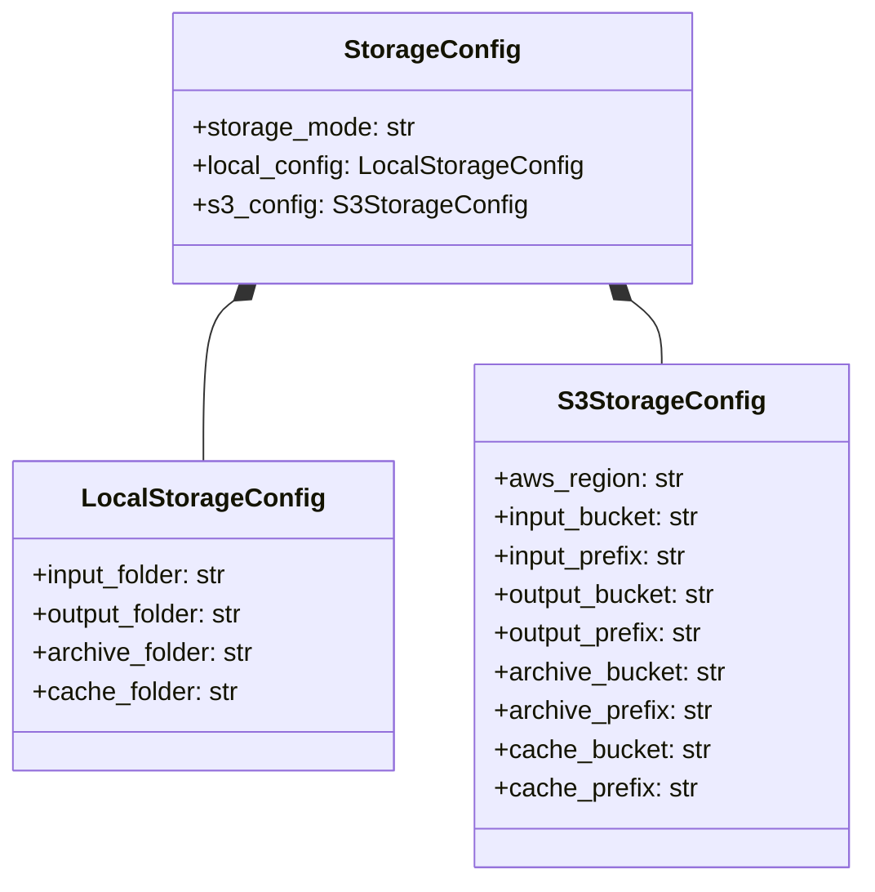

# AWS S3 Storage Integration Plan

This document outlines the plan for enhancing the system to support both local file system storage and AWS S3 storage with a centralized configuration mechanism.

## Current System Analysis

### File System Operations
- The system uses local directories for input (`drop`), output (`output`), and archiving (`archive`)
- Paths are defined as constants in `main_config.py`
- `marshaller.py` handles caching of agent responses in a local `cache` directory
- `main_file_utils.py` provides utilities for file operations (directory creation, checkpoints, archiving)

### AWS S3 Integration
- Two standalone scripts (`aws-pull-to-drop.py` and `aws-push-to-output.py`) handle S3 operations
- These scripts use environment variables for configuration (loaded from a .env file)
- They operate independently from the main application flow

### Entry Points
- `main.py`: CLI entry point that processes CSV files from the input folder
- `api.py`: FastAPI application with endpoints for processing individual claims

## Plan for AWS S3 Integration

### 1. Create a Storage Abstraction Layer



### 2. Enhance Configuration System



### 3. Implementation Plan

#### 3.1. Create Storage Provider Interface and Implementations

1. Create a new module `storage_providers` with the following files:
   - `__init__.py`
   - `base.py` (StorageProvider interface)
   - `local_provider.py` (LocalStorageProvider implementation)
   - `s3_provider.py` (S3StorageProvider implementation)

2. Implement the StorageProvider interface with common file operations:
   - `read_file(path)`
   - `write_file(path, content)`
   - `list_files(directory)`
   - `delete_file(path)`
   - `move_file(source, destination)`
   - `file_exists(path)`
   - `create_directory(path)`

3. Implement LocalStorageProvider using standard Python file operations

4. Implement S3StorageProvider using boto3 for AWS S3 operations

#### 3.2. Update Configuration System

1. Modify `config.json` to include storage configuration:
   ```json
   {
     "storage": {
       "mode": "local",  // or "s3"
       "local": {
         "input_folder": "drop",
         "output_folder": "output",
         "archive_folder": "archive",
         "cache_folder": "cache"
       },
       "s3": {
         "aws_region": "us-east-1",
         "input_bucket": "your-input-bucket",
         "input_prefix": "input/",
         "output_bucket": "your-output-bucket",
         "output_prefix": "output/",
         "archive_bucket": "your-archive-bucket",
         "archive_prefix": "archive/",
         "cache_bucket": "your-cache-bucket",
         "cache_prefix": "cache/"
       }
     },
     // existing configuration...
   }
   ```

2. Update `main_config.py` to load and provide access to the storage configuration

3. Create a factory function to instantiate the appropriate StorageProvider based on configuration

#### 3.3. Refactor File Operations

1. Create a `storage_manager.py` module that:
   - Initializes the appropriate StorageProvider based on configuration
   - Provides a unified interface for file operations
   - Handles path translation between local and S3 paths

2. Update `main_file_utils.py` to use the StorageManager instead of direct file operations

3. Update `marshaller.py` to use the StorageManager for cache operations

4. Update `agents/compliance_report_agent.py` to use the StorageManager for cache operations:
   - Replace direct file system operations with StorageManager calls
   - Update the CACHE_FOLDER constant to use the configured path from StorageManager
   - Modify file operations (mkdir, open, glob) to use the appropriate StorageProvider methods

#### 3.4. Update Entry Points

1. Modify `main.py` to use the StorageManager for file operations

2. Update `api.py` to use the StorageManager for file operations


### 4. Testing Plan

1. Create unit tests for each StorageProvider implementation

2. Create integration tests for the StorageManager

3. Test the system with both local and S3 storage modes

4. Create a test script to verify the migration of existing data between storage modes

### 5. Deployment Considerations

1. Update documentation to explain the new storage configuration options

2. Create a migration script to help users transition existing data to S3 if needed

3. Update environment variable handling to support AWS credentials

4. Consider implementing credential rotation and security best practices

## Implementation Details

### Key Files to Create/Modify

#### New Files:
1. `storage_providers/base.py` - StorageProvider interface
2. `storage_providers/local_provider.py` - LocalStorageProvider implementation
3. `storage_providers/s3_provider.py` - S3StorageProvider implementation
4. `storage_manager.py` - Factory and unified interface

#### Files to Modify:
1. `main_config.py` - Add storage configuration
2. `main_file_utils.py` - Use StorageManager
3. `marshaller.py` - Use StorageManager for cache operations
4. `agents/compliance_report_agent.py` - Use StorageManager for cache operations
5. `main.py` - Update file operations
6. `api.py` - Update file operations
7. `config.json` - Add storage configuration

### Example Implementation of StorageProvider Interface

```python
# storage_providers/base.py
from abc import ABC, abstractmethod
from typing import List, Optional, Union, BinaryIO

class StorageProvider(ABC):
    """Interface for storage operations."""
    
    @abstractmethod
    def read_file(self, path: str) -> bytes:
        """Read a file and return its contents as bytes."""
        pass
    
    @abstractmethod
    def write_file(self, path: str, content: Union[str, bytes, BinaryIO]) -> bool:
        """Write content to a file."""
        pass
    
    @abstractmethod
    def list_files(self, directory: str, pattern: Optional[str] = None) -> List[str]:
        """List files in a directory, optionally filtered by pattern."""
        pass
    
    @abstractmethod
    def delete_file(self, path: str) -> bool:
        """Delete a file."""
        pass
    
    @abstractmethod
    def move_file(self, source: str, destination: str) -> bool:
        """Move a file from source to destination."""
        pass
    
    @abstractmethod
    def file_exists(self, path: str) -> bool:
        """Check if a file exists."""
        pass
    
    @abstractmethod
    def create_directory(self, path: str) -> bool:
        """Create a directory."""
        pass
```

### Example Implementation of StorageManager Factory

```python
# storage_manager.py
from typing import Dict, Any
from storage_providers.base import StorageProvider
from storage_providers.local_provider import LocalStorageProvider
from storage_providers.s3_provider import S3StorageProvider

class StorageManager:
    """Factory and unified interface for storage operations."""
    
    @staticmethod
    def create_provider(config: Dict[str, Any]) -> StorageProvider:
        """Create a storage provider based on configuration."""
        storage_mode = config.get("storage", {}).get("mode", "local")
        
        if storage_mode == "local":
            local_config = config.get("storage", {}).get("local", {})
            return LocalStorageProvider(
                input_folder=local_config.get("input_folder", "drop"),
                output_folder=local_config.get("output_folder", "output"),
                archive_folder=local_config.get("archive_folder", "archive"),
                cache_folder=local_config.get("cache_folder", "cache")
            )
        elif storage_mode == "s3":
            s3_config = config.get("storage", {}).get("s3", {})
            return S3StorageProvider(
                aws_region=s3_config.get("aws_region", "us-east-1"),
                input_bucket=s3_config.get("input_bucket", ""),
                input_prefix=s3_config.get("input_prefix", ""),
                output_bucket=s3_config.get("output_bucket", ""),
                output_prefix=s3_config.get("output_prefix", ""),
                archive_bucket=s3_config.get("archive_bucket", ""),
                archive_prefix=s3_config.get("archive_prefix", ""),
                cache_bucket=s3_config.get("cache_bucket", ""),
                cache_prefix=s3_config.get("cache_prefix", "")
            )
        else:
            raise ValueError(f"Unsupported storage mode: {storage_mode}")